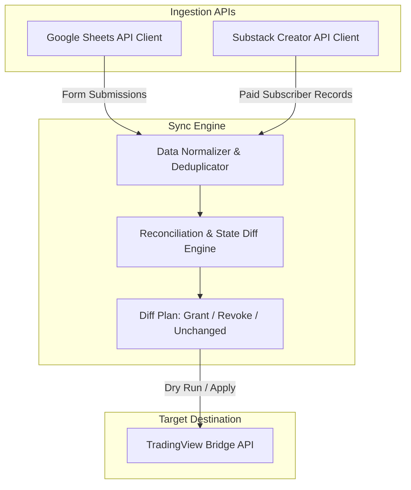

# OpenSpec: Project Overview & Scope

## 1. Project Goal
Provide a fully automated, deterministic, and privacy-preserving bridge between **Substack Paid Subscribers** and an **Invite-Only TradingView Indicator** via direct API integrations.

---

## 2. Core Architecture

---

## 3. Guiding Principles & Constraints

1. **Spec as Single Source of Truth**: All ingestion contracts, reconciliation logic, and TradingView bridge interactions must follow specs in `openspec/specs/`.
2. **100% API-Driven**: Ingestion is handled purely through direct API connections (Substack creator session API and Google Sheets API) without manual file exports.
3. **Privacy & Security**:
   - Subscriber emails and usernames are processed in memory and never logged to public or insecure destinations.
   - Authentication tokens (`substack.sid`, `sessionid`) are loaded exclusively from `.env`.
4. **Idempotency & Safety**:
   - Every sync operation supports dry-run mode (`diff` / `sync`) to preview actions before applying changes to TradingView.
   - Re-running the sync engine multiple times produces identical, safe results.
5. **Resilience**:
   - All external API calls implement exponential backoff retry for transient network hiccups and rate limits.
6. **Observability & Error Auditing**:
   - Expired session tokens, API schema modifications, and network errors are explicitly caught and logged to `logs/sync_errors.log` with actionable remediation guidance.
