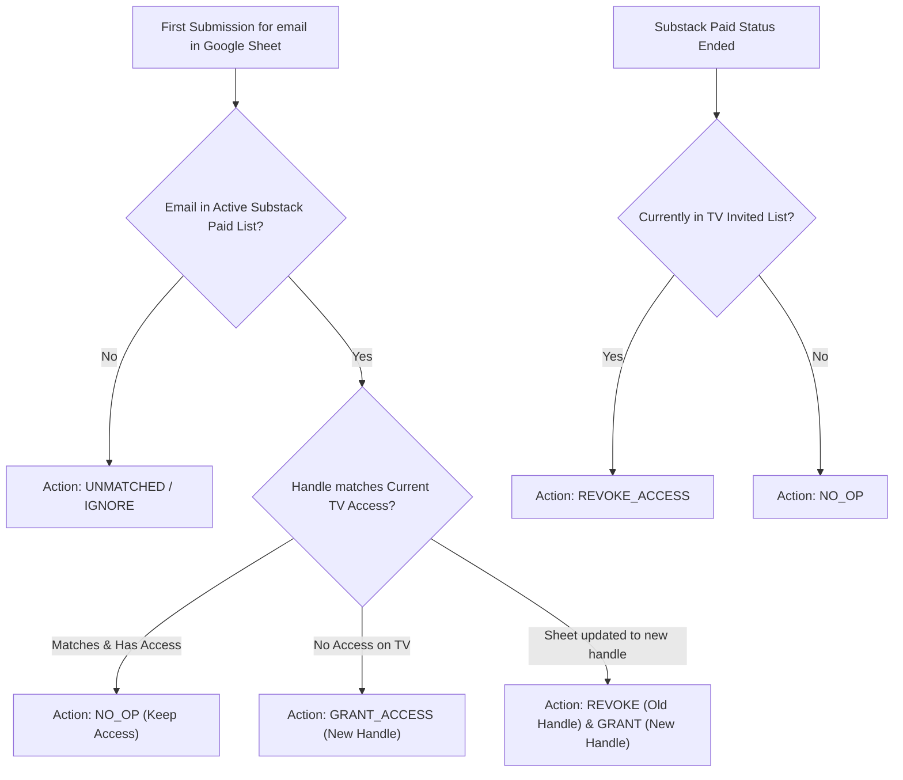

# Spec 02: Reconciliation & Diff Engine Logic

## 1. Overview
This specification details the reconciliation algorithm that compares submitted Google Form entries against active Substack subscribers and current TradingView access permissions to produce a safe, deterministic execution plan.

---

## 2. Ingestion & Preprocessing Rules

### 2.1 Field Normalization
1. **Email Normalization**:
   - `email = email.strip().lower()`
2. **Username Normalization**:
   - `username = username.strip().lstrip('@')`

### 2.2 Deduplication: "First Valid Submission Locks Handle"
To eliminate form spam, alert fatigue, and handle-hijacking:
1. **First Submission Wins**: For any given subscriber email, the **first valid row** found in the Google Sheet is accepted as their registered TradingView handle.
2. **Duplicate Submissions Ignored**: Any subsequent form submission for an already-registered email is **silently ignored** by the sync engine.
3. **Authoritative Handle Updates via Google Sheets**:
   - If a subscriber needs to change their TradingView handle, the operator edits the username cell directly in the private Google Sheet.
   - Because the Google Sheet is restricted exclusively to the operator, this ensures that only authenticated, operator-approved handle modifications are synced to TradingView.

### 2.3 Zero Substack Match Filter
Any form submission whose email does NOT match an active paid Substack subscription is classified as `UNMATCHED_FORM_SUBMISSION` and ignored. No TradingView API call is ever made for non-paying emails.

---

## 3. Matching & Classification

For each unique subscriber email in the Google Sheet:

### 3.1 Status Classification Table

| Paid Substack Status | Google Sheet State | Current TV Access | Diff Action | Reason |
| :--- | :--- | :--- | :--- | :--- |
| **Active Paid** | First submission (`userA`) | None | `GRANT (userA)` | Initial claim by paid subscriber. |
| **Active Paid** | Sheet contains (`userA`) | Has (`userA`) | `NO_OP` | Already has access. |
| **Active Paid** | Duplicate form row (`userB`) | Has (`userA`) | `NO_OP (Ignore userB)` | Duplicate form spam ignored. |
| **Active Paid** | Operator edited Sheet to (`userB`) | Has (`userA`) | `REVOKE (userA)`, `GRANT (userB)` | Operator updated handle in Sheet. |
| **Active Paid** | No row in Sheet | None | `UNREGISTERED_PAID` | Paid member hasn't claimed yet. |
| **Canceled / Expired** | Row in Sheet (`userA`) | Has (`userA`) | `REVOKE (userA)` | Subscription ended; access revoked. |
| **Canceled / Expired** | Row in Sheet (`userA`) | None | `NO_OP` | Inactive subscriber without access. |

---

## 4. Diff Plan Output

The reconciliation engine outputs a structured `DiffPlan` object containing:
- **`grants`**: List of TradingView usernames to add.
- **`revokes`**: List of TradingView usernames to remove (canceled members or updated handles).
- **`unregistered_paid`**: List of active Substack subscribers who haven't submitted the form yet.
- **`unmatched_form_submissions`**: List of form submissions from emails with no active paid subscription.
